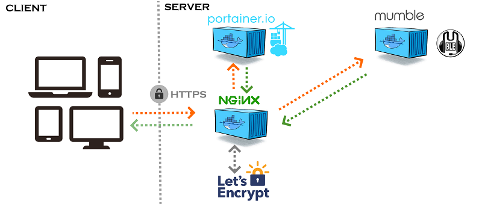

docker-mumble-NGINX-Let's Encrypt
=============

    

  Docker image for Mumble server.

INSTRUCTION
---------------------

This version use the projet of EvertRamos : docker-compose-letsencrypt-nginx-proxy-companion

Please install first evertramos/docker-compose-letsencrypt-nginx-proxy-companion
https://github.com/evertramos/docker-compose-letsencrypt-nginx-proxy-companion

    git clone https://github.com/Tofdu31/docker-mumble-nginx-letsencrypt
    
Configure files projet Mumble Server
---------------------

1: Configure .env
---------------------
Open .env and change :

a) adress_mumble_server= Change Address for your server Mumble

b) port_mumble_server= Change the port of mumble (by default : 64738)

c) password_mumble_server= Change Password of your superuser

d) name_mumble_server=MUMBLE SERVER (parameter if you wish to give your "Root" channel a custom name.)

e) DOMAINS=mumble.your.domain.com

f) LETSENCRYPT_EMAIL=your_email_to_register@lets_encrypt

OPTIONNAL : Edit the Config
---------------
Edit :

files/config.ini

And add your instruction !

Once you have a running container, you can edit the config with:

    docker exec -it mumble-server vi /etc/mumble/config.ini
    
After saving changes, restart your container:

    docker restart mumble-server

2 : Running the Container
---------------------

In order to persist configuration data when upgrading your container you should create a named data
volume. This is not required but is _highly_ recommended.

    docker volume create --name mumble-data

And

    docker-compose up -d

3 : Get/Set the SuperUser Password
---------------------

After starting your container, you can get the randomly generated SuperUser password with:

    docker logs mumble-server 2>&1 | grep "Password for 'SuperUser'"

--- OR ---

Manually set a new SuperUser password with:

    docker exec -it mumble-server supw

NOTE: This can be run at any time to update the SuperUser password

--- OR ---

Provide a SuperUser password using the SUPERUSER_PASSWORD environment variable (see the Optional docker run arguments section above).

Troubleshooting
---------------

For general help and support for MUMBLE join our [Slack Workspace](https://join.slack.com/t/phlaknet/shared_invite/enQtNzk0ODkwMDA2MDg0LWI4NDAyZGRlMWEyMWNhZmJmZjgzM2Y2YTdhNmZlYzc3OGNjZWU5MDNkMTcwMWQ5OGI5ODFmMjI5OWVkZTliN2M).

Please report bugs for MUMBLE to the [GitHub Issue Tracker](https://github.com/PHLAK/docker-mumble/issues).

Copyright
---------

This project is licensed under the [MIT License](https://github.com/PHLAK/docker-mumble/blob/master/LICENSE).
